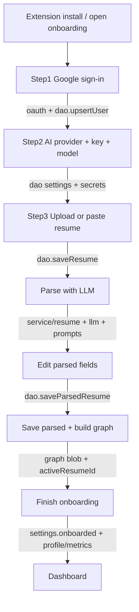

# Onboarding workflow

End-to-end path for first-time setup: UI in `src/component/onboarding`, logic in `src/service`, config in `src/static`.

## Flow

## Storage

All domain data is IndexedDB `jobsimp-graph` via [`src/dao/`](../src/dao/). See [`DATABASE.md`](./DATABASE.md).

| Store | Holds |
|---|---|
| `settings` | provider, model, gmail, emailTemplate, onboarded, widgetResumeId |
| `secrets` | llmKeys, accessToken, expiresAt, sessionExpiresAt |
| `user` / `profile` / `metrics` | identity + contact + EEO |
| `resume` / `graph` | resumes + derived graphs |

## Manual test checklist

1. Load unpacked → onboarding opens.
2. Sign in → Next → enter AI key → upload resume → Parse → Save → Finish.
3. DevTools → IndexedDB `jobsimp-graph` → `settings:current.onboarded === true`, `secrets:current.llmKeys` has key.
